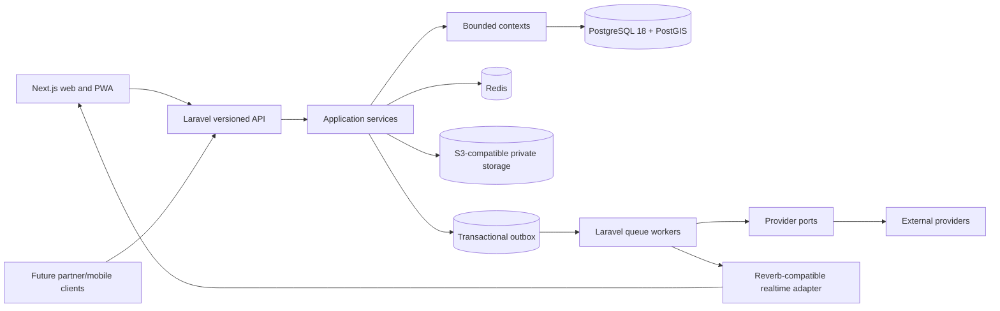
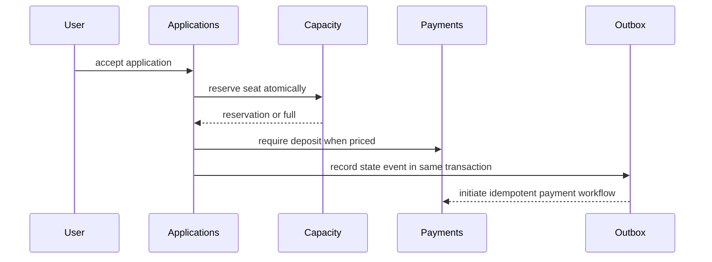

# Domain map

**Status:** Accepted architecture baseline  
**Updated:** 2026-09-14

## System shape

The platform is an API-first modular monolith. Laravel 13 on PHP 8.5 owns business rules and durable state; the Next.js frontend consumes versioned API contracts. PostgreSQL 18 with PostGIS is authoritative. Redis supports cache, queues, throttling, ephemeral presence, and realtime coordination using separated namespaces/connections. Protected binary data lives behind an S3-compatible storage port.

The exact current-stable Next.js release is locked by the repository foundation workflow. Domain code must not depend on a Next.js server action or external provider SDK.

## Bounded contexts

| Context | Owns | Publishes / consumes | Allowed dependencies |
|---|---|---|---|
| Identity | Credentials, passkeys, MFA, sessions, devices, login history | Publishes identity/security events | Platform Security only |
| Profiles | Public profile, preferences, visibility grants, private personal profile | Consumes identity IDs; publishes visibility changes | Identity identifiers, Privacy |
| Organizations | Tenants, members, professional profiles, credentials, staff | Publishes membership/credential events | Identity, Verification, Regional Policy |
| Verification | Verification cases, evidence references, status/expiry | Publishes status and expiry events | Identity, Documents, provider ports |
| Journeys | Journey aggregate, modes/types, lifecycle, days, versions, templates | Publishes lifecycle/itinerary events | Profiles by ID, Organizations by ID, Regional Policy |
| Routes | Stops, locations, transport legs, geometry, disclosure precision | Publishes route/leg changes | Journeys, Maps provider port, Privacy |
| Activities | Activity definitions, capacity, demand, alternatives | Publishes activity/capacity/risk-input changes | Journeys, Eligibility, Safety |
| Eligibility | Versioned rules, evaluations, evidence-status references | Publishes pass/fail/warning outcomes | Activities, Documents status; never raw health/document content |
| Journey Operations | Meals, equipment, accommodation, room allocation, readiness, attendance, live mode | Publishes readiness/check-in/assignment events | Journeys, Participants, Safety |
| Applications | Join questions/answers, application and commitment state histories, waitlist | Publishes application/acceptance events | Journeys, Eligibility, Participants, Payments status |
| Participants | Journey membership and journey-scoped roles | Publishes membership/role events | Applications, Identity identifiers |
| Communities | Clubs, memberships, discussions, recurring journey links | Publishes community membership/events | Identity identifiers, Journeys |
| Meetups | Social, romantic opt-in, business meetup flows | Publishes meetup/application events | Identity age/adult assertion, Trust, Location Privacy |
| Messaging | Threads, channels, messages, attachments, acknowledgments, translation links | Publishes message/acknowledgment events | Participants, Trust, Media, Notifications |
| Notifications | Preferences, notifications, delivery attempts | Consumes domain events | Identity contact channels, provider ports |
| Safety | Private safety profiles, risk, plans, briefings, check-ins, SOS, incidents, near misses | Publishes restricted safety events | Journeys, Activities, Participants, Privacy, provider ports |
| Documents | Metadata, encrypted object references, verification facts, retention | Publishes verified/expired/deleted facts | Identity, Privacy, private storage/scanning ports |
| Marketplace | Journey-attached offers, reservations, fulfillment and provider references | Publishes booking lifecycle events | Journeys, provider ports, Payments |
| Payments | Intents, charges, refunds, payouts, disputes, reconciliation, immutable ledger | Publishes financial state events | Applications/Bookings by reference, provider ports, Compliance |
| Expenses | Budgets, expenses, shares, balances, exchange-rate snapshots | Publishes settlement events | Journeys, Participants, Money kernel |
| Reviews | Verified, double-blind, multidimensional reviews and reputation signals | Consumes completion; publishes review/reputation events | Participants, Journeys, Trust |
| Trust & Moderation | Blocks, reports, abuse signals, cases, actions, appeals | Consumes safety/message/payment signals | Identity references, scoped evidence, Audit |
| Search | Privacy-filtered public/search projections and saved searches | Consumes publish/change/delete events | Journeys/Routes public projections, provider port |
| Recommendations | Explainable preference-based suggestions | Consumes non-sensitive approved signals | Search, Profiles explicit preferences |
| Media & Memories | Media ownership/consent, albums, journals, lost-and-found | Consumes journey completion | Journeys, Participants, Trust, storage port |
| AI | Redacted requests, structured outputs, confidence, human approvals, usage metadata | Consumes authorized snapshots; publishes draft suggestions | AI gateway ports only; no direct table/provider access |
| Regional Policy | Versioned jurisdiction rules, disclosures, feature eligibility | Publishes policy changes | Compliance-authored configuration |
| Privacy & Compliance | Consent/purpose, retention, subject requests, exports, deletion restrictions | Consumes data lifecycle events | Every context through narrow policy interfaces |
| Admin & Support | Purpose-bound operational views and support cases | Consumes projections; issues authorized commands | Context public application APIs only |
| Analytics | Pseudonymous product/operational events and aggregates | Consumes allowlisted events | No raw restricted data or transaction-path dependency |
| Integrations | Concrete adapters for payments, maps, weather, verification, messaging, AI, storage | Translates provider events | Domain-owned ports and contracts only |

## Aggregate boundaries

- `Journey` owns lifecycle and graph membership references, not every child row. Large children use their own aggregates keyed by `journey_id` and validate through application services.
- `JourneyVersion` is append-only. Applying an approved change creates a new version and an outbox event in the same transaction.
- `Application` owns its state history; acceptance coordinates capacity atomically with `JourneyCapacity` and never uses count-then-insert.
- `Booking` owns provider lifecycle and idempotency; provider callbacks cannot mutate a journey directly.
- `LedgerAccount` and `LedgerTransaction` enforce balanced immutable entries. Corrections are compensating transactions.
- `SafetyIncident`, `VerificationCase`, `ModerationCase`, and `SupportCase` are separately authorized aggregates with auditable access.
- `PrivateSafetyProfile`, `IdentityEvidence`, `FinancialAccount`, and `PublicProfile` never share one aggregate or broad repository.

## Dependency rules

1. HTTP controllers, CLI commands, jobs, and websocket handlers call application services; they contain no business rules.
2. Contexts exchange stable identifiers, immutable DTOs, and domain events. A context cannot import another context's internal models or repositories.
3. Cross-context synchronous calls are permitted only through published application interfaces when an immediate invariant requires them. Non-critical reactions use the transactional outbox.
4. External SDKs exist only in adapters. Domain packages define provider ports and normalized failure types.
5. PostgreSQL is the source of truth. Redis, search projections, websocket state, and analytics are rebuildable.
6. Public/query projections are constructed after authorization and location-precision policy; hidden values must never be fetched and then merely removed in React.
7. Shared code is limited to stable kernels: identifiers, money, time, locale, correlation/idempotency, problem details, authorization primitives, and event envelopes.

## Key event flows

Material itinerary changes follow `proposal/authorized command → impact calculation → approval → new version → transactional event → notifications → required acknowledgments`. Provider callbacks follow `signature and freshness check → inbox deduplication → transactional domain transition → outbox`, so retries cannot create duplicate success.

## Extraction policy

A context may become a service only when measured independent scaling, fault isolation, availability, technology, or team ownership needs outweigh distributed-system cost. Extraction requires an ADR and preserves existing API/event contracts. Shared-database table access is never the extraction mechanism.
