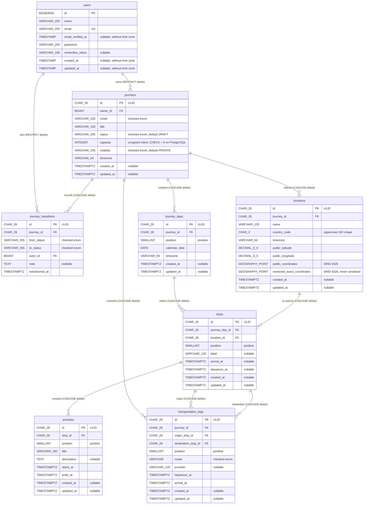

# Current database ERD

**Status:** Synchronized with implemented migrations  
**Updated:** 2026-09-14

This document covers the current application-domain schema. Framework-owned cache, jobs, sessions, and personal-access-token tables are intentionally omitted. The source migrations are:

- `apps/api/database/migrations/0001_01_01_000000_create_users_table.php`
- `apps/api/database/migrations/2026_09_14_060411_create_journeys_table.php`
- `apps/api/database/migrations/2026_09_14_060412_create_journey_transitions_table.php`
- `apps/api/database/migrations/2026_09_14_070000_create_journey_graph_tables.php`

## Relationships and deletion behavior

| Child column | Parent | Cardinality | On delete |
|---|---|---|---|
| `journeys.owner_id` | `users.id` | Each journey has one owner; a user owns zero or more journeys | `RESTRICT` |
| `journey_transitions.journey_id` | `journeys.id` | Each transition belongs to one journey; a journey has zero or more transitions | `CASCADE` |
| `journey_transitions.actor_id` | `users.id` | Each transition records one actor; a user may act on zero or more transitions | `RESTRICT` |
| `journey_days.journey_id` | `journeys.id` | A journey has ordered calendar days | `CASCADE` |
| `locations.journey_id` | `journeys.id` | A journey owns its approximate/restricted location records | `CASCADE` |
| `stops.journey_day_id` | `journey_days.id` | A day has ordered stops | `CASCADE` |
| `stops.location_id` | `locations.id` | A stop references one journey-owned location | `CASCADE` |
| `transportation_legs.journey_id` | `journeys.id` | A journey has ordered transportation legs | `CASCADE` |
| `transportation_legs.origin_stop_id` | `stops.id` | A leg begins at one stop | `CASCADE` |
| `transportation_legs.destination_stop_id` | `stops.id` | A leg ends at a different stop | `CASCADE` |
| `activities.stop_id` | `stops.id` | A stop has ordered activities | `CASCADE` |

## Constraints and indexes

### `users`

- Primary key: `id` (`BIGSERIAL` on PostgreSQL).
- Unique constraint/index: `email`.

### `journeys`

- Primary key: `id`, a 26-character ULID.
- Foreign key: `owner_id → users.id`, restricted on delete.
- Enum checks: `mode ∈ {SOCIAL, EXPERIENCE, PROFESSIONAL, PRIVATE_GROUP}`; `status` uses all 15 lifecycle states; `visibility ∈ {PRIVATE, UNLISTED, PUBLIC}`.
- PostgreSQL check: `journeys_capacity_positive` enforces `capacity > 0`.
- Composite indexes: `journeys_owner_created_id_index (owner_id, created_at, id)` and `journeys_discovery_index (visibility, status, created_at)`.

### `journey_transitions`

- Primary key: `id`, a 26-character ULID.
- Foreign keys: `journey_id → journeys.id` cascades on delete; `actor_id → users.id` restricts deletion.
- `from_status` and `to_status` use the same 15 checked lifecycle values as `journeys.status`.
- PostgreSQL check: `journey_transitions_status_changed` enforces `from_status <> to_status`.
- History index: `journey_transitions_history_index (journey_id, transitioned_at, id)`.
- No `created_at` or `updated_at` columns; `transitioned_at` is the event time.

### Journey Graph tables

- `journey_days` is unique by `(journey_id, position)` and `(journey_id, calendar_date)`; PostgreSQL enforces positive positions.
- `locations` indexes `(journey_id, name)`, constrains public latitude/longitude ranges and uppercase two-letter country codes, and has a GiST spatial index on `public_coordinates`. Exact coordinates are deliberately not indexed for discovery.
- `stops` is unique by `(journey_day_id, position)`, indexes `(location_id, arrival_at)`, and constrains departure to occur at or after arrival when both exist.
- `transportation_legs` is unique by `(journey_id, position)`, indexes its stop pair, constrains positive positions, distinct endpoints, and arrival after departure, and limits mode to `AIR`, `RAIL`, `ROAD`, `SEA`, or `WALK`.
- `activities` is unique by `(stop_id, position)`, indexes `(stop_id, starts_at)`, and constrains positive positions and a positive time interval.
- SQLite tests replace the two PostGIS geography columns with restricted decimal latitude/longitude columns. Production PostgreSQL retains separate public and restricted geography points.

Laravel's PostgreSQL grammar compiles Blueprint `enum` fields as `VARCHAR(255)` with check constraints, `ulid` as `CHAR(26)`, `timestamps()` without time zone, and `timestampsTz()` with time zone. Application validation additionally caps journey capacity at 100,000, validates IANA timezones, proves leg adjacency, and rounds public coordinate output independently from restricted exact storage; those rules are not all expressible as local row constraints.
