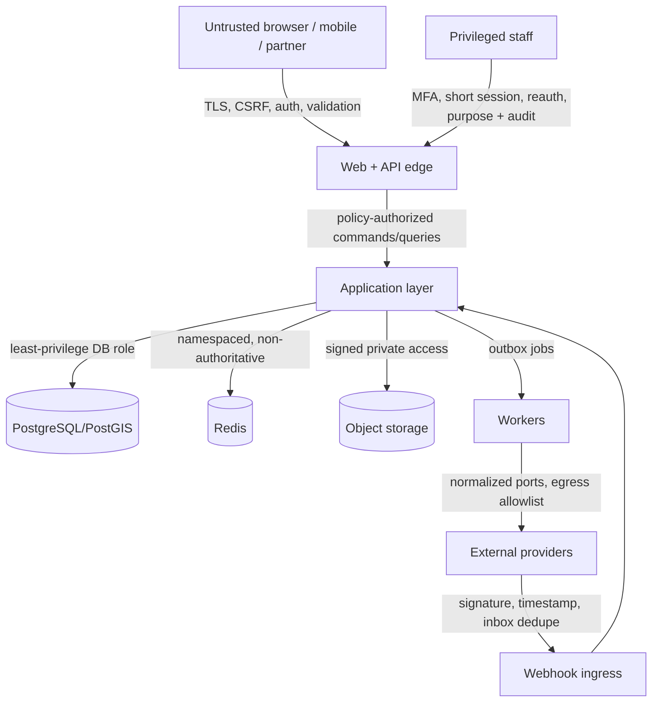

# Threat model

**Status:** Accepted initial model; re-review required for every vertical slice  
**Method:** STRIDE plus privacy and abuse-case analysis  
**Updated:** 2026-09-14

## Scope and security objectives

This model covers the browser/PWA, future mobile and partner clients, Laravel API/workers/scheduler, Next.js rendering tier, PostgreSQL/PostGIS, Redis, S3-compatible storage, realtime transport, and all external provider adapters.

Priority objectives are: protect people from location-enabled harm; prevent unauthorized access to identity, health, safety, message, minor and financial data; preserve journey/booking/payment integrity; keep critical trip information available through provider outages; and produce reliable audit evidence without logging secrets.

## Assets and threat actors

Critical assets include credentials and sessions; exact future/live locations; dependent/minor data; private safety and health data; identity and travel documents; messages; booking references; ledger/payout data; provider and signing secrets; moderation/incident evidence; itinerary versions; and offline trip packs.

Threat actors include unauthenticated scrapers, abusive or stalking users, malicious applicants/participants/organizers, compromised accounts, fraudulent traders, over-privileged support/admin staff, compromised provider accounts, forged webhook senders, malicious uploaded files, supply-chain attackers, and accidental operators.

## Trust boundaries

Data crossing any boundary is untrusted. Provider success, websocket messages, cache entries, AI output, imported documents, and frontend type declarations never establish authorization or truth.

## Threat register

| ID | Threat / abuse case | Affected assets | Required controls and verification | Residual risk / response |
|---|---|---|---|---|
| TM-01 | Credential stuffing, brute force, session fixation or stolen device | Accounts, sessions | Argon2id password hashing; distributed contextual throttles; secure HttpOnly/SameSite cookies; CSRF; session rotation; MFA/passkeys; device/session list and revocation; suspicious-login alerts; reauth for sensitive changes | Adaptive detection can miss novel attacks; revoke sessions and notify user on credible signal |
| TM-02 | Horizontal/vertical IDOR, including acceptance scenario F | C3 data, messages, payouts | Deny-by-default server policies using subject, organization, journey, role, state, purpose and data class; scoped queries; opaque IDs only as defense in depth; negative API/repository tests for exact location, health, ID, message and payout access | Policy defects remain possible; central decision logging and recurring privilege tests |
| TM-03 | Stalker enumerates profiles, future routes or romantic targets | Personal safety, location | Approximate public geometry generated server-side; no hidden coordinates in payloads; delayed route sharing; adult explicit romantic opt-in; blocks across discovery/messages/applications; anti-enumeration pagination, rate limits and anomaly detection | Public descriptions can be correlated externally; warn publishers and provide rapid takedown/blocking |
| TM-04 | Organizer or staff over-collects/reads health, identity or minor data | Safety/identity/minor data | Schema allowlists; data-class review; status assertions instead of documents; separate encrypted stores; role/purpose gates; reauth and read audit; retention enforcement | Legitimate staff may misuse viewed data; minimize disclosure and review anomalous access |
| TM-05 | Malicious admin/support insider or compromised privileged account | All sensitive assets | Separate scoped roles; no universal data browser; MFA/passkeys; short sessions; reauth; reason codes; dual control for payout/critical policy changes; tamper-evident audit; alerting | Authorized screenshots cannot be fully prevented; contractual/process controls and incident response supplement technical controls |
| TM-06 | CSRF, XSS, malicious Markdown/link or open redirect | Sessions, users | SameSite cookies and CSRF tokens; output encoding; structural rendering/sanitization; CSP nonces/hashes; safe URL allowlists; secure headers; no unsafe HTML injection | Browser/extensions remain outside control; security headers and report-only monitoring before enforcement changes |
| TM-07 | SQL/command injection, mass assignment, insecure deserialization, path traversal | Database, host, files | Parameterized ORM/queries; DTO allowlists; strict runtime validation; no shell interpolation; safe serializers; canonical object keys; static analysis and malicious-input tests | New adapters may bypass conventions; boundary review and CI security checks |
| TM-08 | SSRF through imports, previews, webhooks or provider URLs | Internal services/secrets | Fixed provider base URLs, egress allowlist, scheme/host validation, DNS/IP checks, redirect limits, metadata-network denial, fetch size/time limits | DNS rebinding/provider compromise; resolve/connect policy and network-level egress controls |
| TM-09 | Malicious upload, polyglot file, malware or unauthorized download | Users, storage, staff devices | Signature/MIME/extension/size checks; quarantine; malware scan; safe image re-encode; private buckets; randomized keys; short signed URLs; download authorization and audit; never execute files | Scanner zero-days; quarantine and content-disposition reduce exposure |
| TM-10 | Forged/replayed/out-of-order provider callback | Booking/payment/verification state | Provider-specific signature and timestamp verification on raw body; inbox unique event ID; idempotent transactional handler; legal state transitions; replay/out-of-order tests; payload retention minimization | Provider semantics may be ambiguous; reconcile from provider source of truth before manual resolution |
| TM-11 | Duplicate clicks/jobs race for last seat, activity, equipment, refund or payout | Capacity and money | Database constraints; row locks or atomic conditional writes; idempotency keys; transaction boundaries; unique inbox/outbox keys; concurrency tests including scenarios D/E | Lock contention under surges; observe latency and fail safely to retry/waitlist |
| TM-12 | Ledger mutation, partial refund/payout commit or fabricated payment success | Financial integrity | Balanced immutable double-entry ledger; compensating entries; provider-hosted/tokenized UI; transaction/outbox; reconciliation; separation of duties; production startup/runtime rejects fake adapter | Provider insolvency/dispute is external; reconciliation and reserves/business controls required |
| TM-13 | Cache/CDN/search leaks private or deleted content | Location, profiles, messages | Classification-aware cache keys; private/no-store defaults; public projection tables; authorization before cache; purge/tombstone fanout; no C3 indexing; signed URL revocation strategy | Third-party cache purge latency; defined 24-hour maximum and immediate origin denial |
| TM-14 | Websocket channel guessing or presence disclosure | Messages, location, membership | Authenticate subscription and every command; channel names carry no authority; short-lived grants; server-side membership checks; database authoritative; rate limits | Revocation propagation delay; disconnect on membership/security events |
| TM-15 | AI prompt injection, data exfiltration, hallucinated booking/legal/safety fact or unauthorized action | Private data, safety, money | Central AI gateway; authorized minimal snapshots; C3 excluded by default; redaction; tool allowlists; structured output validation; suggestions remain drafts; material action confirmation; qualified human approval for high/extreme safety content; no direct frontend provider calls | Model output remains untrusted; label uncertainty and preserve non-AI paths |
| TM-16 | Translation changes safety-critical meaning | Announcements, safety | Preserve original; label machine translation; source text is authoritative; confirmation/qualified review for critical content; version and acknowledge original | Users may rely on translation; prominent warning and human translation channel |
| TM-17 | Offline pack or local draft exposes private trip data | Exact locations, documents | Per-user authorized manifest; minimal data; encrypted local storage/package; expiry; remote revocation metadata; no shared-device persistence by default; safe service-worker cache segregation | A copied/decrypted pack cannot be remotely erased; short validity and user guidance |
| TM-18 | Account deletion/export leaks third-party data or leaves derived copies | Privacy rights | Ownership-aware export; C4 exclusion; legal-retention classification; deletion tombstones to cache/search/CDN/storage/analytics; restore re-tombstoning; auditable workflow | Provider backups may expire asynchronously; disclose truthful timelines |
| TM-19 | Provider outage/timeout corrupts state or blocks live trips | Availability, booking integrity | Timeouts, bounded retries/backoff, circuit breakers, normalized unavailable state, idempotency, transactional state machine; cached critical trip data; provider-independent views; scenario H tests | Long outage may prevent new booking/payment; communicate state and prevent false success |
| TM-20 | Denial of service, bot scraping or expensive geo/search/AI query | Availability, privacy, cost | Request/body/query limits; distributed throttles; cursor pagination; bounded map radii/complexity; AI quotas; CDN for C0; queue isolation; backpressure and cost alerts | Distributed attacks may exceed origin capacity; upstream WAF/DDoS service is deployment-specific |
| TM-21 | Log/trace/analytics leakage or log injection | Secrets and C2/C3 data | Structured allowlisted fields; newline/control escaping; redaction at source; no request bodies/tokens/documents/health/location; pseudonymous analytics; restricted retention/access | Developer-added fields may regress; automated secret/PII checks and sampling review |
| TM-22 | Dependency/container/CI compromise or secret leakage | Build and production | Lockfiles, provenance/checksums, SAST/SCA/secret scanning, SBOM/license review, least-privilege CI, pinned actions/images, isolated builds, image scanning/signing | Upstream zero-days remain; patch SLA and rollbackable deploys |
| TM-23 | Timezone manipulation or chronology inconsistency causes unsafe itinerary | Journey/safety integrity | UTC instants plus IANA zone context; validated intervals; versioned changes; simulation for impossible/overlap/buffer cases; user-visible zone labels | Provider schedule changes remain external; advisories and acknowledgment workflows |
| TM-24 | Minor enters adult/romantic flows or guardian relationship is forged | Child safety | Adult primary-account baseline; age/guardian assertions; dependent model; romantic eligibility gate; no independent messaging/commercial commitments; verification escalation and reports | Age assurance is imperfect; product/legal review required before any minor primary account model |
| TM-25 | Audit evidence is altered or becomes a surveillance dataset | Accountability/privacy | Append-only/tamper-evident records; hash chaining or protected log sink; narrow event schemas; separate access policy; audit reads; retention | Database administrators remain powerful; external immutable sink and organizational controls in production |

## Security invariants

- No client-supplied role, visibility, price, ledger amount, provider status, AI confidence, or verification flag is trusted.
- Exact location and C3 content are absent—not merely visually hidden—from unauthorized responses, caches, analytics, search, AI context, and realtime channels.
- Durable transitions happen in PostgreSQL transactions. An outbox communicates effects after commit; idempotent consumers tolerate duplicates.
- Payment, identity and safety development adapters cannot start or execute in production mode.
- Emergency UI distinguishes contacting emergency services from notifying platform contacts; the platform does not claim automatic emergency dispatch.
- Critical trip information remains readable when AI, recommendations, analytics, weather, or another non-critical provider is unavailable.

## Review and test gates

Each slice updates this register with concrete endpoints, tables, policies and provider semantics. Required suites include authorization matrices; CSRF/session tests; rate limits; malicious upload; SSRF; signed URL expiry; webhook signature/replay/order; concurrency; private cache/search payloads; deletion propagation; websocket subscription; AI redaction/tool authorization; production fake-provider rejection; and degraded-provider flows.

Critical or high findings block release. Medium findings block unless the documented residual risk, owner, compensating control and review date are accepted in a security decision record.
